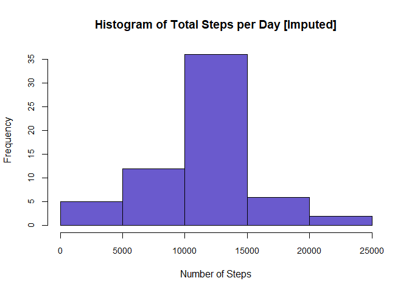

```r
knitr::opts_chunk$set(echo = TRUE)
```
# Loading and Preprocessing the Data
A zip file containing the dataset is already present in the forked Github repository.
First, the file needs to be unzipped and then read in. 

```r
unzip("activity.zip")
file <- read.csv("activity.csv")
```
# What is the mean total number of steps taken per day?
1. Calculate the total number of steps taken per day

```r
library(lubridate)
```

```
## 
## Attaching package: 'lubridate'
```

```
## The following objects are masked from 'package:base':
## 
##     date, intersect, setdiff, union
```

```r
file$steps <- as.numeric(file$steps)
totalsteps <- tapply(file$steps, file$date, sum)
totalsteps1 <- data.frame(totalsteps, names(totalsteps), row.names = NULL)
totalsteps2 <- totalsteps1[complete.cases(totalsteps1$totalsteps), ]
colnames(totalsteps2) <- c("steps", "date")
totalsteps2$date <- ymd(as.character(totalsteps2$date))
print(totalsteps2)
```

```
##    steps       date
## 2    126 2012-10-02
## 3  11352 2012-10-03
## 4  12116 2012-10-04
## 5  13294 2012-10-05
## 6  15420 2012-10-06
## 7  11015 2012-10-07
## 9  12811 2012-10-09
## 10  9900 2012-10-10
## 11 10304 2012-10-11
## 12 17382 2012-10-12
## 13 12426 2012-10-13
## 14 15098 2012-10-14
## 15 10139 2012-10-15
## 16 15084 2012-10-16
## 17 13452 2012-10-17
## 18 10056 2012-10-18
## 19 11829 2012-10-19
## 20 10395 2012-10-20
## 21  8821 2012-10-21
## 22 13460 2012-10-22
## 23  8918 2012-10-23
## 24  8355 2012-10-24
## 25  2492 2012-10-25
## 26  6778 2012-10-26
## 27 10119 2012-10-27
## 28 11458 2012-10-28
## 29  5018 2012-10-29
## 30  9819 2012-10-30
## 31 15414 2012-10-31
## 33 10600 2012-11-02
## 34 10571 2012-11-03
## 36 10439 2012-11-05
## 37  8334 2012-11-06
## 38 12883 2012-11-07
## 39  3219 2012-11-08
## 42 12608 2012-11-11
## 43 10765 2012-11-12
## 44  7336 2012-11-13
## 46    41 2012-11-15
## 47  5441 2012-11-16
## 48 14339 2012-11-17
## 49 15110 2012-11-18
## 50  8841 2012-11-19
## 51  4472 2012-11-20
## 52 12787 2012-11-21
## 53 20427 2012-11-22
## 54 21194 2012-11-23
## 55 14478 2012-11-24
## 56 11834 2012-11-25
## 57 11162 2012-11-26
## 58 13646 2012-11-27
## 59 10183 2012-11-28
## 60  7047 2012-11-29
```
2. Make a histogram of the total number of steps taken each day

```r
hist(totalsteps2$steps, main = "Histogram of Total Steps per Day", xlab = 
       "Number of Steps", cex.axis = 0.9, col = "slateblue")
```

<!-- -->

3. Calculate and report the mean and median of the total number of steps taken per day

```r
mean1 <- mean(totalsteps2$steps)
print(mean1)
```

```
## [1] 10766.19
```

```r
median1 <- median(totalsteps2$steps)
print(median1)
```

```
## [1] 10765
```
# What is the average daily activity pattern?
1. Make a time series plot (type = "l") of the 5-minute interval (x-axis) and the average number of steps taken, averaged across all days (y-axis)

```r
avgsteps <- tapply(file$steps, file$interval, mean, na.rm = TRUE)
avgsteps1 <- data.frame(avgsteps, names(avgsteps), row.names = NULL)
colnames(avgsteps1) <- c("steps", "interval")
avgsteps1$interval <- as.numeric(avgsteps1$interval)

with(avgsteps1, plot(interval, steps, type = "l", xlab = "Interval (min)", main = 
                       "Average Steps per 5 Min Interval"))
```

<!-- -->

2. Which 5-minute interval, on average across all the days in the dataset, contains the maximum number of steps?

```r
max <- avgsteps1[max(avgsteps1$steps), ]
max$interval
```

```
## [1] 1705
```
# Imputing missing values
1. Calculate and report the total number of missing values in the dataset (i.e. the total number of rows with NAs)

```r
sum(!complete.cases(file))
```

```
## [1] 2304
```
2. Devise a strategy for filling in all of the missing values in the dataset.

```r
meansteps <- mean(file$steps, na.rm = TRUE)
```
3. Create a new dataset that is equal to the original dataset but with the missing data filled in.

```r
library(Hmisc)
```

```
## Loading required package: lattice
```

```
## Loading required package: survival
```

```
## Loading required package: Formula
```

```
## Loading required package: ggplot2
```

```
## 
## Attaching package: 'Hmisc'
```

```
## The following objects are masked from 'package:base':
## 
##     format.pval, units
```

```r
steps <- file$steps
steps2 <- impute(steps, meansteps)
file2 <- data.frame(steps2, file$date, file$interval, row.names = NULL)
colnames(file2) <- c("steps", "date", "interval")
head(file2)
```

```
##     steps       date interval
## 1 37.3826 2012-10-01        0
## 2 37.3826 2012-10-01        5
## 3 37.3826 2012-10-01       10
## 4 37.3826 2012-10-01       15
## 5 37.3826 2012-10-01       20
## 6 37.3826 2012-10-01       25
```
4. Make a histogram of the total number of steps taken each day and calculate and report the mean and median total number of steps taken per day. Do these values differ from the estimates from the first part of the assignment? What is the impact of imputing missing data on the estimates of the total daily number of steps?

```r
totalsteps3 <- tapply(file2$steps, file2$date, sum)
totalsteps4 <- data.frame(totalsteps3, names(totalsteps3), row.names = NULL)
totalsteps5 <- totalsteps4[complete.cases(totalsteps4$totalsteps), ]
colnames(totalsteps5) <- c("steps", "date")
totalsteps5$date <- ymd(as.character(totalsteps5$date))

hist(totalsteps5$steps, main = "Histogram of Total Steps per Day [Imputed]", xlab = 
       "Number of Steps", cex.axis = 0.9, col = "slateblue")
```

<!-- -->

```r
mean2 <- mean(totalsteps5$steps)
print(mean2)
```

```
## [1] 10766.19
```

```r
if(mean2 == mean1){
  print("No, the means are equal.")
} else if(mean2 < mean1) {
  print("Yes, the imputed mean is lower.")
} else {
  print("Yes, the imputed mean is higher.")
}
```

```
## [1] "No, the means are equal."
```

```r
median2 <- median(totalsteps5$steps)
print(median2)
```

```
## [1] 10766.19
```

```r
if(median2 == median1){
  print("No, the medians are equal.")
} else if(median2 < median1) {
  print("Yes, the imputed median is lower.")
} else {
  print("Yes, the imputed median is higher.")
}
```

```
## [1] "Yes, the imputed median is higher."
```
# Are there differences in activity patterns between weekdays and weekends?
1. Create a new factor variable in the dataset with two levels - "weekday" and "weekend" indicating whether a given date is a weekday or weekend day.

```r
file2$date <- ymd(as.character(file2$date))
daytypes <- wday(file2$date, label = TRUE)
daytypes1 <- c()
for(i in daytypes){
  if(i == "Sun"){
    daytypes1 <- c(daytypes1, "weekend")
  } else if(i == "Sat"){
    daytypes1 <- c(daytypes1, "weekend")
  } else {
    daytypes1 <- c(daytypes1, "weekday")
  }
}
daytypes2 <- factor(daytypes1, levels = c("weekday", "weekend"))
file3 <- data.frame(file2, daytypes2)
```
2. Make a panel plot containing a time series plot (type = "l") of the 5-minute interval (x-axis) and the average number of steps taken, averaged across all weekday days or weekend days (y-axis). 

```r
weekdays <- file3[file3$daytypes2 == "weekday", ]
weekends <- file3[file3$daytypes2 == "weekend", ]

avgweekdays <- tapply(weekdays$steps, weekdays$interval, mean, na.rm = TRUE)
avgweekends <- tapply(weekends$steps, weekends$interval, mean, na.rm = TRUE)
avgweekdays1 <- data.frame(avgweekdays, names(avgweekdays), row.names = NULL)
colnames(avgweekdays1) <- c("steps", "interval")
avgweekdays1$daytype <- c("weekday")
avgweekends1 <- data.frame(avgweekends, names(avgweekends), row.names = NULL)
colnames(avgweekends1) <- c("steps", "interval")
avgweekends1$daytype <- c("weekend")
combined <- rbind(avgweekdays1, avgweekends1)
combined$interval <- as.numeric(combined$interval)

g <- ggplot(data = combined, mapping = aes(interval, steps, group = 1)) + 
  geom_line()
g + facet_grid(daytype~.) + theme_bw() 
```

<!-- -->
